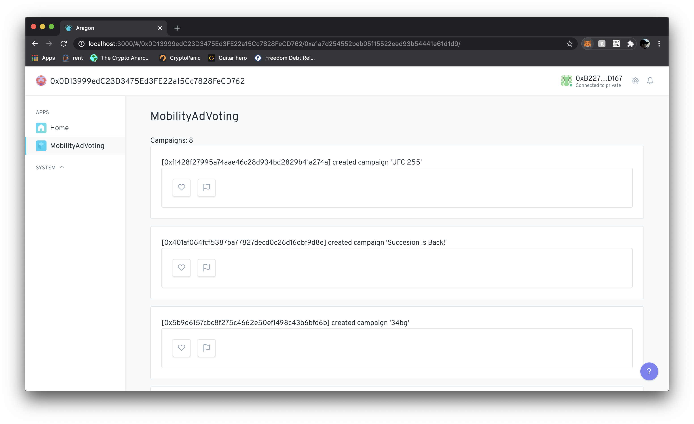

# mobility-ads-dao
built using Aragon tutorial: https://hack.aragon.org/docs/tutorial

idea is to offer governance around ad campaigns created using smart contracts at: https://github.com/imthatcarlos/dark-horse-mobility-contracts

flow would be:
- advertisers create campaigns via client app that creates records in the smart contract
- campaign data is indexed using [the graph](https://thegraph.com/explorer/subgraph/imthatcarlos/dark-horse-mobility-campaigns)
- ads are rendered for users on whatever client app

in this repo:
- users can then approve of campaigns by liking them, or flag them for removal ([contracts/MobilityAdVoting.sol](contracts/MobilityAdVoting.sol))
- new solidity code written for this logic [here in this commit](https://github.com/imthatcarlos/dark-horse-mobility-contracts/commit/0009a58f3dc76a0bd03965c2fb15374e21808f29)
- smart contract inherits from `AragonApp` which provides common governance logic
- users of the aragon app with role `COMMUNITY_ROLE` can ultimately Feature and Blacklist campaigns with enough votes

TODO:
- reducer needs to be setup properly in `app/src/script.js` to initialize the state with likes/flags from all given campaign ids
- "like" + "flag" functionality currently not working (check console logs upon clicking button)
- figure out how to add role `COMMUNITY_ROLE` to certain users
- provide UI + functionality for "feature campaign" + "blacklist campaign" for users with role `COMMUNITY_ROLE`
